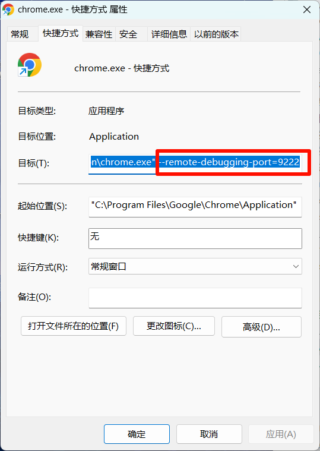

# AI自动投递简历助手

## 项目简介
本项目基于AI接口实现智能简历投递。理论上20分钟可投递100份简历，但实际速度受限于合适岗位的查找速度和系统稳定性。

## 核心功能
- ✨ AI智能岗位匹配度分析（可自定义匹配阈值）
- 🔍 智能筛选：
  - 学历要求
  - 城市范围
  - 薪资范围
  - 岗位类型
- 👋 自动打招呼功能（支持自定义内容）
- 🤖 自动过滤不活跃HR
- 📊 详细的投递日志记录

## 使用步骤

### 1. 环境准备
```bash
pip install -r requirements.txt
```

### 2. 浏览器配置
1. 为Chrome/Edge浏览器创建快捷方式
2. 在快捷方式属性中的"目标"后添加调试端口参数：
   ```
   "C:\Program Files\Google\Chrome\Application\chrome.exe" --remote-debugging-port=9222
   ```
   

### 3. 系统配置
1. 使用配置好的快捷方式打开浏览器
2. 登录BOSS直聘网站
3. 配置 `config.json`：
   - 设置目标岗位
   - 设置目标城市
   - 设置学历要求
   - 设置薪资范围
4. 在`我的简历.txt`中填入您的简历内容
5. 启动本地AI服务（端口5000）
6. 运行 `main.py`

## 注意事项
1. ⚠️ 已知问题：长时间运行后可能出现找不到合适岗位的情况
2. 💡 如需使用自定义AI模型，请修改 `aiconfig.py` 中的 `ai_response()` 函数
3. 📝 运行日志说明：
   - `本次面试运行日志.txt`：实时运行日志（每次运行清空）
   - `已投递的岗位.txt`：累计投递记录（追加模式）
   - `统计日志.txt`：每轮循环的统计数据（追加模式）

## 致谢
本项目基于 [SanThousand/auto_get_jobs](https://github.com/SanThousand/auto_get_jobs) 重构，感谢原作者的开源贡献。

## 联系方式
- 📧 Email: lanendiencgr@gmail.com
- 🐱 GitHub: lanendiencgr
